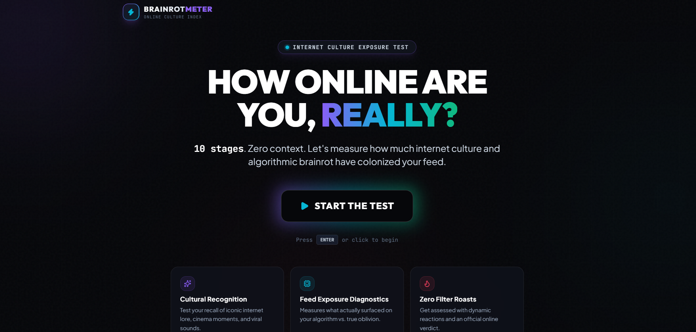
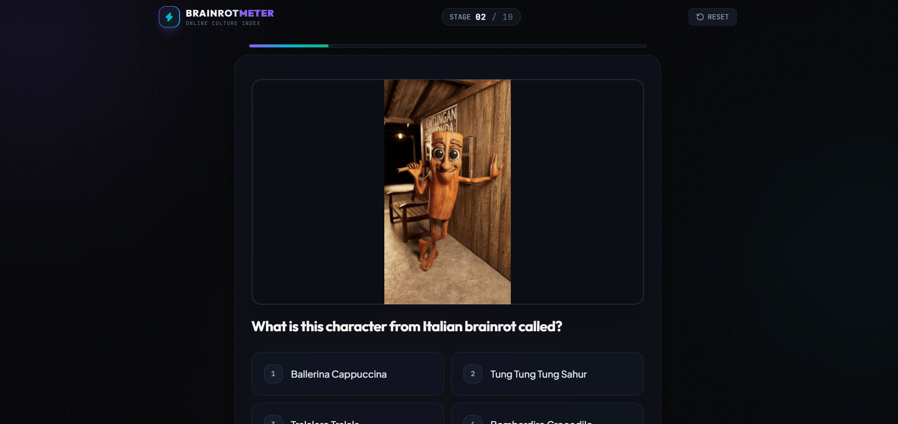
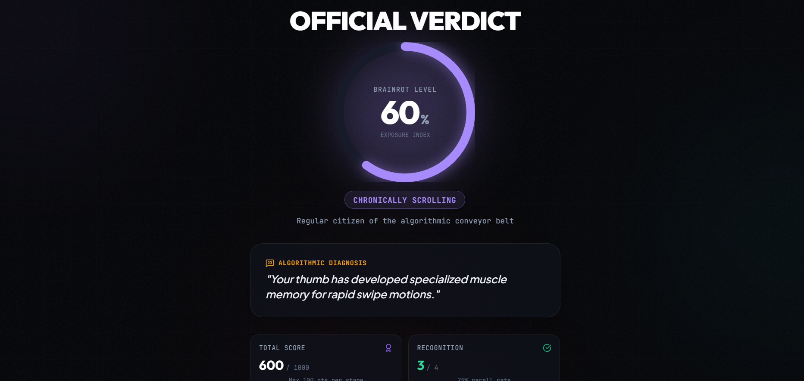

Project Name : BRAINROT METER

Basic Details
Team Name: Go-fers
Team Members
Team Lead: Vaishnavi R - Govt. Model Engineering College ,Kochi

Project Description
Brainrot Meter is a fun web-based quiz that measures how exposed you are to internet culture, viral memes, trends, and online content. Instead of testing intelligence, it tests how much of the internet has invaded your brain.

The Problem (that doesn't exist)
People spend an unreasonable amount of time consuming random internet content, but there is no scientifically questionable way to measure how much of it has actually reached their brain.

The Solution (that nobody asked for)
Brainrot Meter presents users with viral memes, trends, sounds, and internet references and calculates their level of "brainrot" based on how familiar they are with them. The result is a completely unnecessary but surprisingly accurate assessment of your internet exposure.

Technical Details
Technologies/Components Used
For Software:
 Languages used: TypeScript, JavaScript, HTML, CSS
- Frameworks used: React, Vite, Tailwind CSS
- Libraries used: Lucide React, Canvas Confetti
- Tools used: VS Code, Git, GitHub, Vercel

Implementation
For Software:

Installation
npm install

Run
npm run dev

Project Documentation

For Software:

Screenshots 

Home page of the quiz.Click start the quiz.

 
This shows a question from the quiz along with its options

 
This shows the final verdict or the brainrot percentage according to the users answers.

Diagrams

Workflow: The user starts the quiz → answers internet-culture questions → the system evaluates recognition/exposure → calculates the Brainrot Score → generates a verdict → displays the final result.

Project Demo
Video

[Project Demo Video](public/screenshots/Demo.mp4)
 
 The demo video first shows the home page, with the name Brainrot Meter. After clicking the start button we go to the quiz. There are trending movie references, dance trends, and other viral meme related questions which the user has to answer. There is a total of 10 questions. After answering all questions, we get a report showing how much knowledge we have about the trends, which we waste hours watching.

Team Contributions
Vaishnavi R: Full project development, including UI/UX design, frontend development, quiz logic, scoring, media integration, testing, and deployment.
